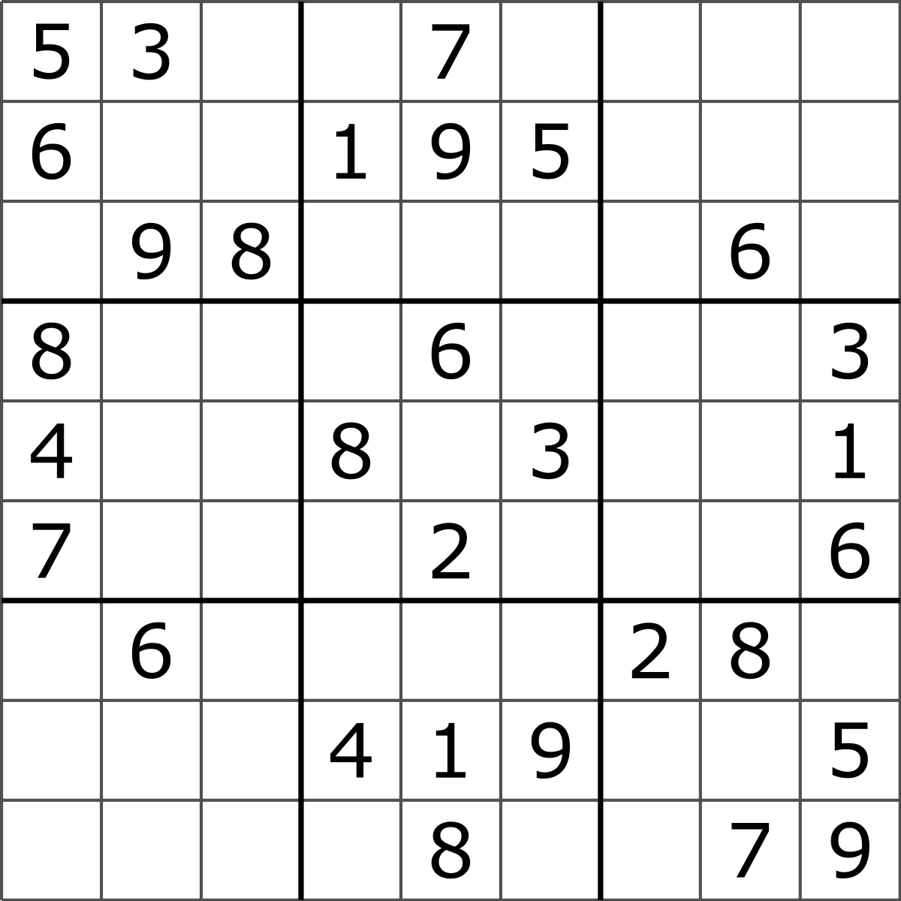
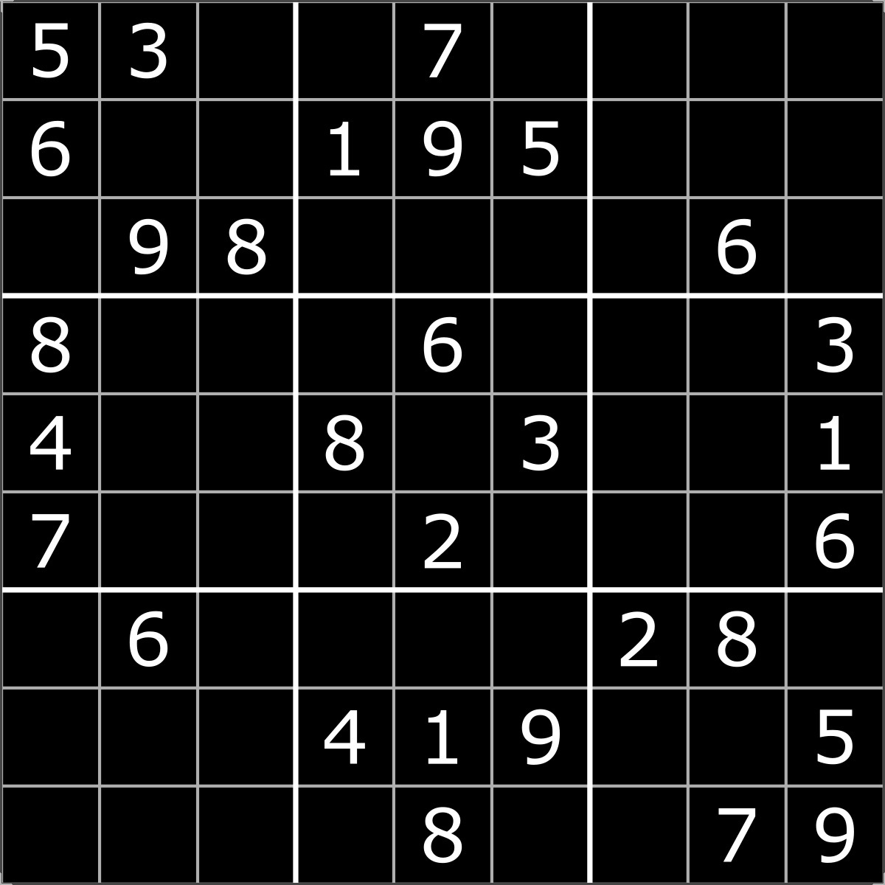
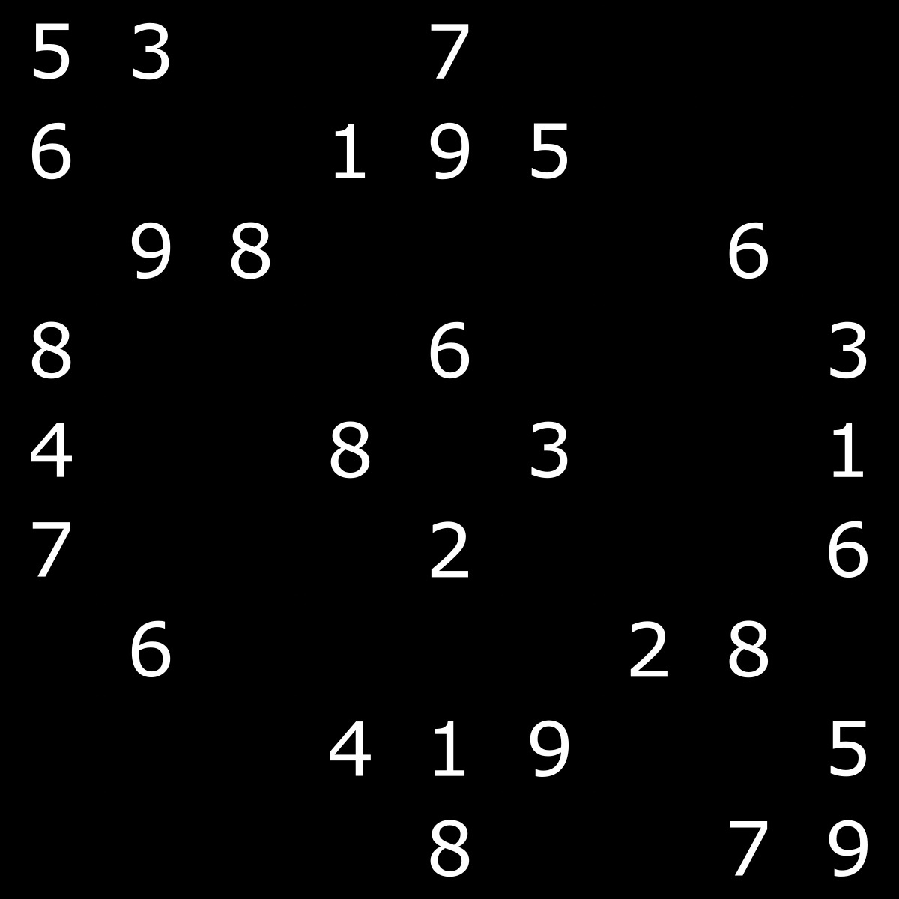
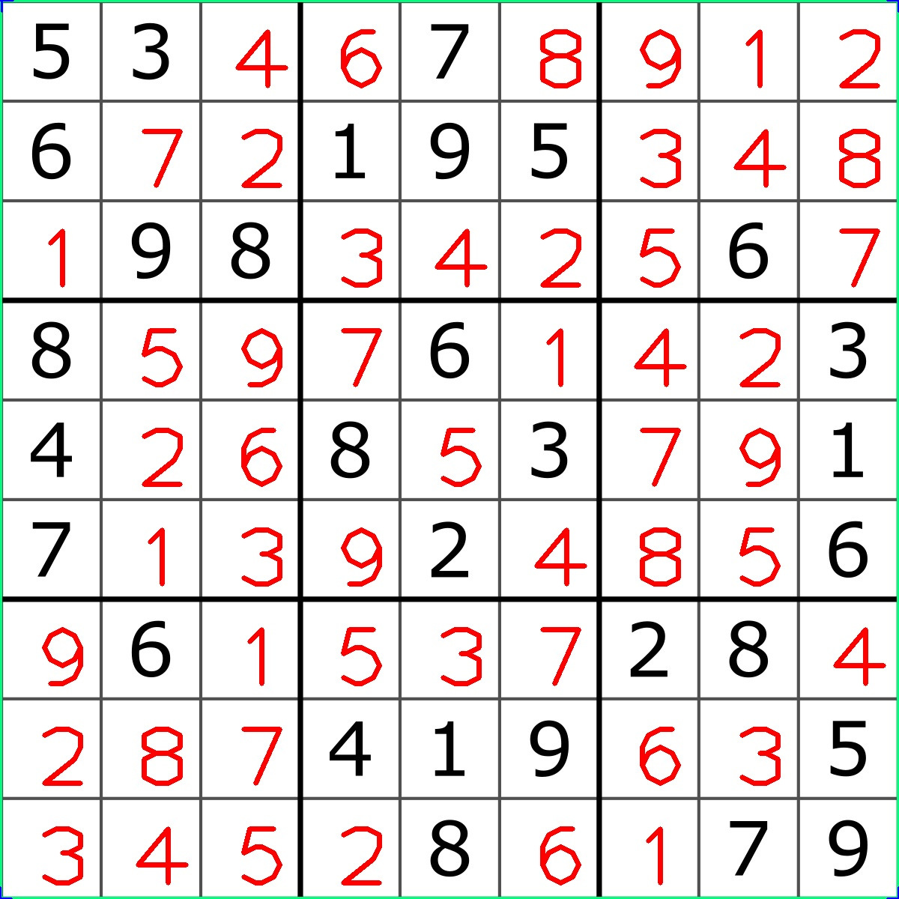

# Sudoku solver with OpenCV and DL4J
Simple project demonstrating how to solve a sudoku puzzle using OpenCV and DL4J libraries.

## Usage
Project comes with already pretrained network that can be found on following path
```
resources/models/trained.tar
```
HINT: You will need to change `ABSOLUTE_PATH` in `Utils.java`

In the resources folder puzzle that needs to be solved can also be found


Running `SudokuSolver.java` image will be processed

All lines between cells will be removed

Digits are then cut out and stored in digits folder where they are feed to the trained network for evaluation.

  

Final result is printed then on the debugging image.


### Training network
If you want to train your own network you would need to run `MnistClassifier.java`. MNIST data set can be found in the
resource folder. You can also add your own. If number of digits change make sure that you update `N_SAMPLES_TRAINING`
property.

### Youtube
Video tutorial for this project can be found on following link
[Youtube](https://www.youtube.com/watch?v=O2LTX00LKHY&list=PLXy8DQl3058MBCLLy1e0oYvWkOzvIKjm3)